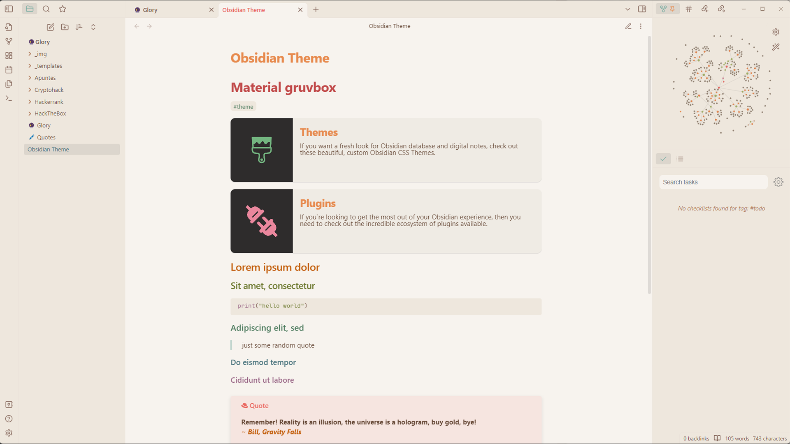

# Obsidian Material gruvbox 


This theme is based on the current [obsidian gruvbox](https://github.com/insanum/obsidian_gruvbox) theme, but with the [material version of Gruvbox](https://github.com/sainnhe/gruvbox-material).

## DARK


## LIGHT


### Adjust theme colors
Install the [Style Settings plugin](https://github.com/mgmeyers/obsidian-style-settings) and use the provided overrides.

Some people have told me that the light theme tones are too yellow; a lighter version of the light theme uses the following colors:
```
Light 0 Hard: #f7f3ee
Light 0:      #f5f2ec
Light 0 Soft: #efebe4
Light 1:      #eee7dd
Light 2:      #ebe3da
Light 3:      #ded7ce
Light 4:      #c4beb7
```

