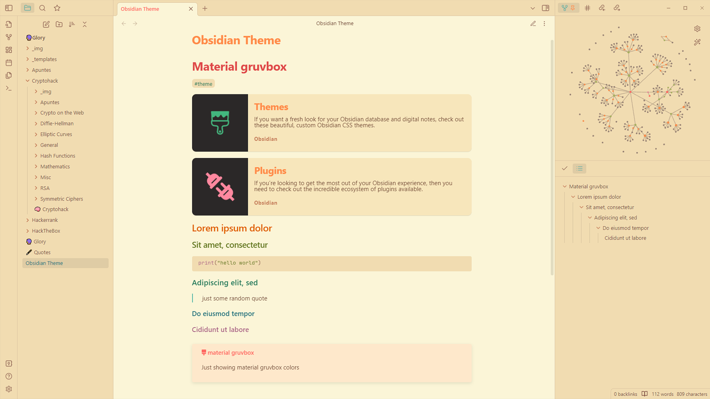

# Obsidian Material gruvbox 


This theme is based on the current [obsidian gruvbox](https://github.com/insanum/obsidian_gruvbox) theme, but with the [material gruvbox](https://gist.github.com/Cardoso1994/5fbbf98603b44bc986ec18e607b7dbf1) palete.

## DARK


## LIGHT


### Change background colors
Some people have told me that the light theme tones are too yellow. Since the theme is already set, I won't change it, but you can create a CSS snippet to fix it if you want to. Go to `Settings -> Apparence -> CSS snippets (at the bottom)`, click the folder icon and create a file with the name `light-background` and add the following content:
```
:root {
    --light0-hard_x:    247,243,238; /* #f7f3ee */
    --light0-hard:      rgb(var(--light0-hard_x));
    --light0_x:         245,242,236; /* #f5f2ec */
    --light0:           rgb(var(--light0_x));
    --light0-soft_x:    239,235,228; /* #efebe4 */
    --light0-soft:      rgb(var(--light0-soft_x));
    --light1_x:         238,231,221; /* #eee7dd */
    --light1:           rgb(var(--light1_x));
    --light2_x:         235,227,218; /* #ebe3da */
    --light2:           rgb(var(--light2_x));
    --light3_x:         222,215,206; /* #ded7ce */
    --light3:           rgb(var(--light3_x));
    --light4_x:         196,190,183; /* #c4beb7 */
    --light4:           rgb(var(--light4_x));
}
```
Then reload the CSS snippets and activate it.
